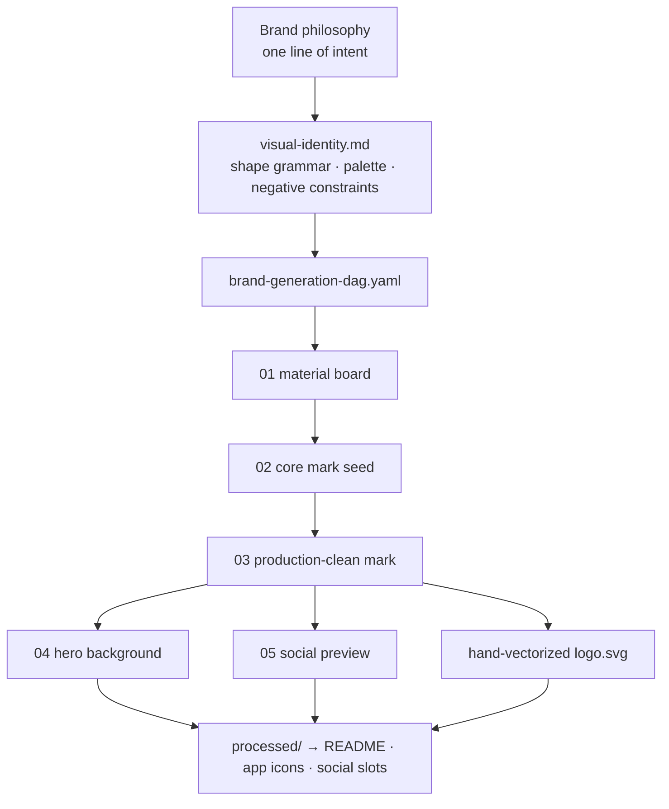

<div align="center">


# generate-brand-kit

**Parts in, brand out.**
One line of brand philosophy → VI rules → generation DAG → approved masters → product-ready files.

[](#install)
[](scripts/)
[](#-proof-this-repos-brand-was-generated-by-this-skill)

**English** · [简体中文](README.zh-CN.md)

</div>

---

## 🧩 Proof: this repo's brand was generated by this skill

Everything you see above — the logo, the hero banner, the social preview, the
palette — was produced by pointing this skill **at its own repository**. The
full paper trail is committed:

| Artifact | File |
| --- | --- |
| Visual identity rules | [`resources/brand/visual-identity.md`](resources/brand/visual-identity.md) |
| Generation DAG (runnable spec) | [`resources/brand/brand-generation-dag.yaml`](resources/brand/brand-generation-dag.yaml) |
| Approved raster masters | [`resources/brand/approved/`](resources/brand/approved/) |
| Hand-vectorized production logo | [`resources/brand/processed/logo.svg`](resources/brand/processed/logo.svg) |
| Asset inventory & consumption map | [`resources/brand/brand-kit-inventory.md`](resources/brand/brand-kit-inventory.md) |

That is the whole pitch: not "generate a logo," but leave behind a **brand
system another agent can pick up and extend** — documented decisions,
reproducible DAG, and clean approved/rejected hygiene.

## Why this exists

Asking an agent to "make me a logo" produces a one-off image and a mess:

- ❌ prompt-dump logos with no shape grammar, drifting on every regeneration
- ❌ raster files pasted where the product needs SVG / ICNS / adaptive icons
- ❌ rejected explorations left in the asset tree for future agents to consume
- ❌ the visible logo replaced while compiled icons, favicons, and docs stay stale

This skill makes the agent behave like a brand engineer instead:

1. **Read the existing system first** — asset folders, icon build scripts, docs.
2. **Inventory every asset slot** the product actually consumes.
3. **Harden philosophy into VI rules** — shape grammar, palette, negative constraints.
4. **Design a serial generation DAG** so consistency comes from references, not adjectives.
5. **Generate → judge → promote** into `approved/`; quarantine rejects.
6. **Convert to production formats** — hand-vectorized SVG, platform icon sizes.
7. **Integrate and verify** — configs, components, docs, legacy scans.

> The identity is abstracted from the business scenario itself: a brand kit
> is literally a **kit** — standardized parts that assemble into one
> consistent identity across every surface. The logo is that story in one
> mark: four distinct geometric parts, the last tile snapping into place.

## Install

**Claude Code** (personal skills directory):

```bash
git clone https://github.com/Nebutra/generate-brand-kit.git ~/.claude/skills/generate-brand-kit
```

**Codex**: clone into your skills path; the interface metadata lives in
[`agents/openai.yaml`](agents/openai.yaml).

### Upstream dependency: an image-generation skill

Raster stages of the DAG need an image-generation tool. This skill pairs
with the open-source [**generate-image**](https://github.com/TsekaLuk/generate-image)
skill — a pluggable multi-provider CLI (OpenAI `gpt-image-2` by default,
plus 302.AI / OpenRouter / SiliconFlow) whose `--dag-file` format is
exactly what `brand-generation-dag.yaml` is written in:

```bash
git clone https://github.com/TsekaLuk/generate-image.git ~/.claude/skills/generate-image
cd ~/.claude/skills/generate-image && uv sync && cp .env.example .env  # fill in your key
```

Any other image tool works too — the DAG spec is plain YAML — but with
generate-image the committed DAG runs as-is:

```bash
uv run generate-image --dag-file resources/brand/brand-generation-dag.yaml
```

## 60-second start

Inside your agent session, in any repo that needs a brand:

```text
Use generate-brand-kit to design a visual identity for this project.
Philosophy: "<your one-line brand idea>"
```

Or seed the structure by hand first:

```bash
# inventory existing brand surfaces (old-brand migration)
python3 scripts/scan_brand_assets.py . --brand-term oldname --brand-term newname

# scaffold approved/ generated/ processed/ + VI, inventory, and DAG templates
python3 scripts/create_brand_kit_scaffold.py --brand MyProduct \
  --philosophy "one line that the whole identity must express"
```

The agent fills the templates, runs the DAG with whatever image-generation
tool is available, and promotes only approved masters into product paths.

## How the pipeline flows



Consistency is structural: every downstream image references the approved
upstream master, so the mark cannot drift.

## What's inside

```
SKILL.md                     # the skill contract agents load
references/
  workflow.md                # decision gates, "water-shape" interpretation
  asset-taxonomy.md          # every slot a product consumes, with sizes
  generation-dag.md          # serial-consistency DAG patterns
  prompt-patterns.md         # prompt architecture + anti-slop constraints
  validation.md              # QA, integration, legacy-cleanup checks
  trends-2026.md             # rising/falling VI aesthetics, trend trackers
  design-theory.md           # strategy frameworks, DBA science, craft tests
  inspiration-sources.md     # stage-mapped galleries + brand-as-code ecosystem
scripts/
  scan_brand_assets.py       # inventory brand files & text hits in any repo
  create_brand_kit_scaffold.py  # neutral approved/generated/processed scaffold
resources/brand/             # this repo's own kit — a live worked example
```

## Guardrails baked in

- Never leave rejected explorations in product-consumable paths.
- Never ship a one-off raster where the product needs real vectors.
- Never replace the visible logo while compiled assets stay stale.
- Never import a landing-page aesthetic into operational software uninvited.

## Show your kit

Ran this skill on your project? Open an issue with a screenshot of your
`approved/` masters and your one-line philosophy — the best kits get linked
here as worked examples. If the skill saved you a design cycle, **a ⭐ helps
other agents' humans find it.**
