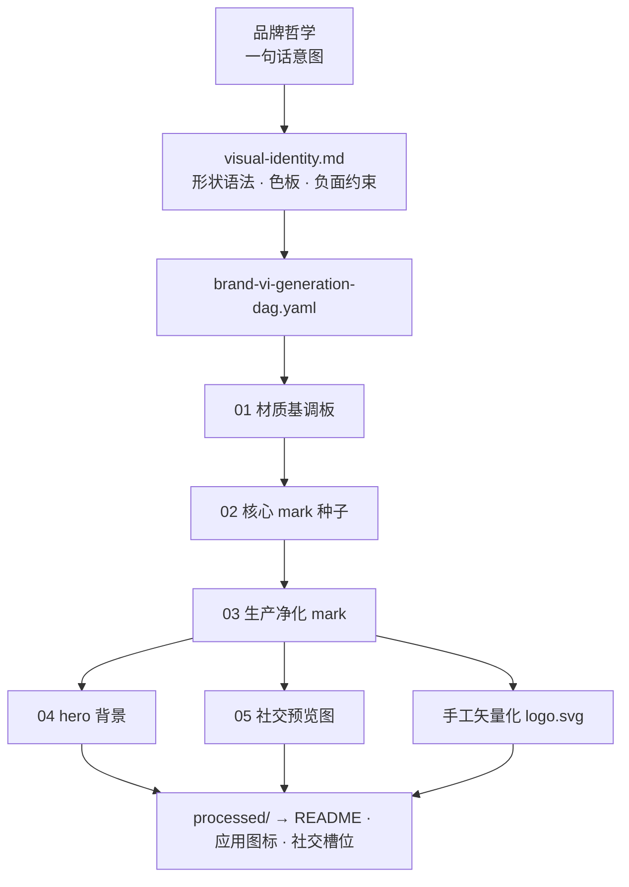

<div align="center">


# generate-brand-vi

**部件进，品牌出。**
一句话品牌哲学 → VI 规则 → 生成 DAG → 批准母版 → 产品级文件。

[](#安装)
[](scripts/)
[](#-证明本仓库的品牌就是这个-skill-自己生成的)

[English](README.md) · **简体中文**

</div>

---

## 🧩 证明：本仓库的品牌就是这个 skill 自己生成的

你在上面看到的一切——logo、hero 横幅、社交预览图、配色——都是把这个 skill
**指向它自己的仓库**跑出来的。完整决策链已提交入库：

| 产物 | 文件 |
| --- | --- |
| 视觉识别规则 | [`resources/brand/visual-identity.md`](resources/brand/visual-identity.md) |
| 生成 DAG（可直接运行的规格） | [`resources/brand/brand-vi-generation-dag.yaml`](resources/brand/brand-vi-generation-dag.yaml) |
| 批准的栅格母版 | [`resources/brand/approved/`](resources/brand/approved/) |
| 手工矢量化的生产 logo | [`resources/brand/processed/logo.svg`](resources/brand/processed/logo.svg) |
| 资产清单与消费映射 | [`resources/brand/brand-vi-inventory.md`](resources/brand/brand-vi-inventory.md) |

这就是全部卖点：不是"生成一个 logo"，而是留下一套**其他 agent 可以接手
并延展的品牌系统**——有记录的决策、可复现的 DAG、干净的批准/废弃隔离。

## 为什么需要它

直接让 agent"给我做个 logo"，得到的是一张一次性图片和一堆烂摊子：

- ❌ 没有形状语法的 prompt 堆砌 logo，每次重新生成都会漂移
- ❌ 产品需要 SVG / ICNS / 自适应图标的地方被塞进栅格图
- ❌ 废弃的探索稿留在资产树里，等着被未来的 agent 误用
- ❌ 只换了可见的 logo，编译产物图标、favicon、文档全都还是旧的

这个 skill 让 agent 像品牌工程师一样工作。它使用可组合的 A1-B13 传统 VI
与 C1-C14 AI SaaS 交付目录：
场景预设只提供起点，再根据组织真实使用表面增删模块。

1. **先读现有系统** —— 资产目录、图标构建脚本、文档。
2. **盘点每一个资产槽位** —— 产品实际消费哪些文件。
3. **把哲学固化成 VI 规则** —— 形状语法、色板、负面约束。
4. **设计串行生成 DAG** —— 一致性来自引用链，而不是形容词。
5. **生成 → 评审 → 晋升** 到 `approved/`；废稿隔离。
6. **转换为生产格式** —— 手工矢量化 SVG、各平台图标尺寸。
7. **集成并验证** —— 配置、组件、文档、遗留扫描。

> 品牌 IP 从业务场景本身抽象而来：brand kit 的字面意思就是**套件**——
> 标准化部件拼装成跨所有表面一致的统一标识。logo 用一个 mark 讲完这个
> 故事：四种不同的几何部件，最后一块正在咔哒入位。

## 安装

**Claude Code**（个人 skills 目录）：

```bash
git clone https://github.com/Nebutra/generate-brand-vi.git ~/.claude/skills/generate-brand-vi
```

**Codex**：克隆到你的 skills 路径；接口元数据在
[`agents/openai.yaml`](agents/openai.yaml)。

### 内置生图后端

DAG 的栅格阶段通过内置适配器调用开源
[**generate-image**](https://github.com/TsekaLuk/generate-image) 后端。适配器会自动发现
同级或全局安装，默认使用 `mox`，并由后端读取全局 `MOX_API_KEY`。

```bash
git clone https://github.com/TsekaLuk/generate-image.git ~/.claude/skills/generate-image
cd ~/.claude/skills/generate-image && uv sync
```

这只是一次性的后端安装；已有的 `MOX_API_KEY` 等全局配置会自动复用。

先免费预览调用数和费用，批准后再执行真实调用：

```bash
python3 scripts/run_brand_image_dag.py --repo .
python3 scripts/run_brand_image_dag.py --repo . --execute
```

## 60 秒上手

在任意需要品牌的仓库里，对你的 agent 说：

```text
使用 generate-brand-vi 为这个项目设计视觉识别。
品牌哲学："<你的一句话品牌理念>"
```

也可以先手动搭好结构：

```bash
# 盘点现有品牌表面（旧品牌迁移场景）
python3 scripts/scan_brand_assets.py . --brand-term 旧名 --brand-term 新名

# 脚手架：VI、逐项生产计划、清单和标志探索 DAG
python3 scripts/create_brand_vi_scaffold.py --brand MyProduct \
  --philosophy "整套识别都必须表达的那一句话" \
  --profile industrial \
  --include-module b13 \
  --exclude-module b3
```

AI SaaS 产品从 `--profile ai-saas` 开始，再删掉产品实际不消费的模块。

agent 会填充模板、用可用的生图工具执行 DAG，并且只把批准的母版
晋升到产品路径。
生产请求以 `brand-vi-production-plan.json` 为准：标志被拒绝只阻塞依赖
标志的条目，基础系统和独立产品系统继续执行。
对于商标法律意见、印刷打样、供应商刀版、空间工程、施工图和原创声音版权，
skill 会生成明确的外部专业交接说明，而不会冒充已经获得专业审批。

## 流水线怎么流



一致性是结构性的：每张下游图都引用上游批准母版，mark 不可能漂移。

## 仓库里有什么

```
SKILL.md                     # agent 加载的 skill 契约
references/
  workflow.md                # 决策关卡，"水形"解读法
  asset-taxonomy.md          # 产品消费的所有槽位及尺寸
  generation-dag.md          # 串行一致性 DAG 模式
  prompt-patterns.md         # prompt 架构 + 反 slop 约束
  validation.md              # QA、集成、遗留清理检查
  trends-2026.md             # VI 美学涨落趋势与追踪源
  design-theory.md           # 策略框架、DBA 科学、工艺测试
  inspiration-sources.md     # 按阶段映射的参考库 + brand-as-code 生态
scripts/
  scan_brand_assets.py       # 盘点任意仓库的品牌文件与文本命中
  create_brand_vi_scaffold.py   # 中立的 approved/generated/processed 脚手架
resources/brand/             # 本仓库自己的 kit —— 活的示例
```

## 内置守则

- 绝不把废弃探索稿留在产品可消费路径里。
- 产品需要真矢量的地方，绝不用一次性栅格图充数。
- 绝不只换可见 logo 而让编译资产过期。
- 绝不擅自把落地页审美带进操作型软件。

## 晒出你的 kit

用这个 skill 跑过你的项目？开个 issue 贴上你的 `approved/` 母版截图和
一句话品牌哲学——最好的 kit 会被链接到这里作为示例。如果它帮你省了一轮
设计周期，**一颗 ⭐ 能帮其他 agent 背后的人类找到它。**
